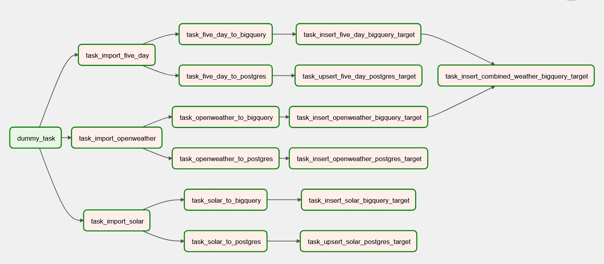

### Solar Data Feed

The purpose of this dag is to source a rolling window of data for my solar panel production account via the SolarEdge API, in addition to rolling windows of local weather forecast data from both OpenWeather and Accuweather.  

The core output of this dag is to facilitate reporting for solar production and weather information.  Additionally, this dag maintains tables in Google BigQuery which are used as inputs to a prediticive model, which is called via a LookerStudio dashboard, providing my household with solar-generation forecast subscriptions.

The flow of the dag can be seen below and is generally set up as follows:
* Rolling windows of data are sourced from the external APIs (solar, and two weather APIs)
* Those API calls are saved off to csv files in a temp directory
* The csv files are uploaded to target databases and staged in transient tables
* The data from the transient tables are merged into their final tables

Data is stored in a local Postgres database along with Google BigQuery (Postgres serves as a fall-back if I cancel my Google Cloud account in the future).

